# Campaign Management System - Architecture Plan

## Executive Summary

The Campaign Management System (CMS) is a web-based platform for planning, approving, executing, monitoring, and analyzing multi-channel marketing campaigns across email, SMS, social media, and push notifications. It serves multiple business workspaces within a single organization, integrates with the enterprise identity provider and CRM, and must enforce strong governance around consent, role-based access control, auditability, and regulatory compliance.

This architecture recommends a **pragmatic phased approach**:

- **MVP / Phase 1**: a **modular application platform** with clear domain boundaries, backed by managed cloud services for identity, messaging queues, object storage, relational data, and analytics.
- **Target / Phase 2+**: evolution toward a more **event-driven, service-oriented architecture** where high-scale domains such as campaign execution, analytics, notifications, and integrations can scale independently.

The design explicitly addresses the key requirements:

- **3-second analytics on up to 1M records** via pre-aggregated metrics, hot-path event streaming, a columnar analytics store, and cache-assisted query serving.
- **99.9% uptime** via multi-AZ managed services, stateless app tiers, rolling deployment, health checks, and operational observability.
- **10M sends/day** via asynchronous orchestration, provider-specific rate limiting, queue-based workers, and elastic horizontal scaling.
- **TLS and AES-256** for data protection in transit and at rest.
- **RBAC + workspace isolation** enforced at identity, API, and data-access layers.
- **Audit retention** of 36 months and campaign analytics retention of at least 24 months.
- **GDPR, CAN-SPAM, and CASL** support through consent tracking, suppression handling, unsubscribe enforcement, auditability, and data lifecycle controls.

---

## System Context

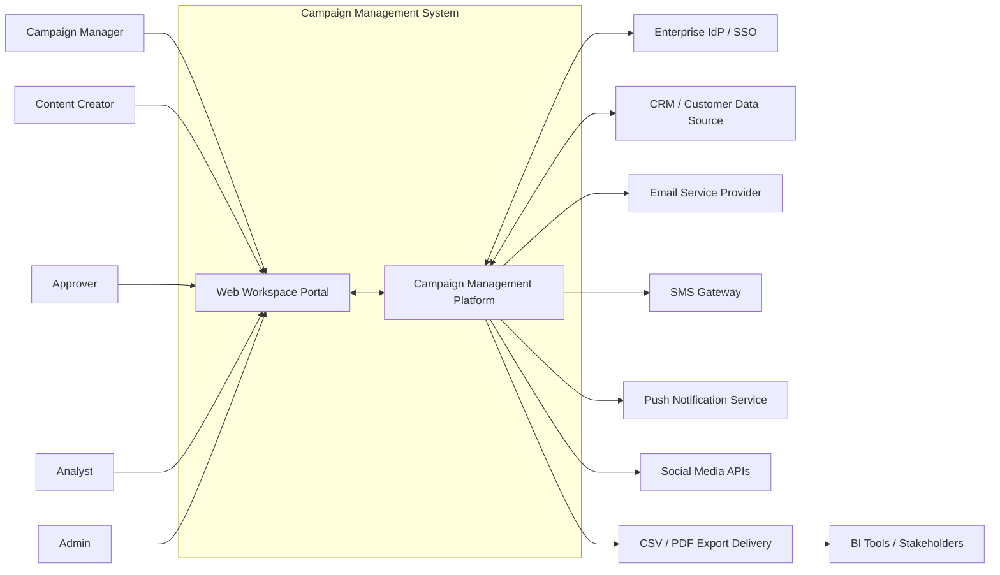

### Overview
This diagram shows the Campaign Management System within the broader enterprise ecosystem: internal business users interact with the CMS, while the platform integrates with external identity, CRM, channel delivery providers, and downstream report consumers.

### Key components
- **Business users**: Campaign Manager, Content Creator, Approver, Analyst, Admin.
- **Web Workspace Portal**: primary browser-based user experience.
- **Campaign Management Platform**: core business logic and orchestration.
- **Enterprise IdP / SSO**: authentication and enterprise user identity.
- **CRM / Customer Data Source**: audience attributes, lists, and segment source data.
- **Channel providers**: ESP, SMS gateway, push, and social APIs.
- **Export / BI consumers**: reports distributed to analysts and stakeholders.

### Relationships
- Users access the CMS through a browser.
- CMS authenticates users through SSO.
- CMS reads audience data from CRM and sends campaign payloads to external providers.
- Campaign performance and exports are distributed to analysts and stakeholders.

### Design decisions
- Keep the CMS focused on orchestration and governance rather than replacing the CRM or delivery providers.
- Use external managed providers for message delivery to reduce operational complexity and accelerate compliance with channel-specific delivery rules.
- Centralize user interaction in a single workspace portal to reduce tool switching.

### NFR considerations
- **Scalability**: external delivery providers absorb channel-specific send scale; the CMS scales as an orchestrator.
- **Performance**: UI remains responsive because heavy send and analytics processing are asynchronous.
- **Security**: SSO, TLS, controlled provider integrations, and export governance reduce exposure.
- **Reliability**: decoupling via integrations and managed services improves fault isolation.
- **Maintainability**: clean boundaries make it easier to evolve channels and providers independently.

### Trade-offs
- Reliance on third-party delivery providers introduces external dependencies.
- CRM latency or data quality can affect audience freshness.

### Risks and mitigations
- **Risk**: provider outages or throttling.  
  **Mitigation**: queue-based retry, provider health dashboards, channel-level circuit breakers.
- **Risk**: inconsistent CRM data.  
  **Mitigation**: ingestion validation, segment preview, stale-data warnings.

---

## Architecture Overview

The recommended architecture uses these patterns:

1. **Domain-oriented application design**
   - Campaign planning
   - Audience and segmentation
   - Content and asset management
   - Approval workflow
   - Scheduling and orchestration
   - Analytics and reporting
   - Administration, RBAC, and audit

2. **Asynchronous execution for scale**
   - Scheduled sends, notifications, analytics ingestion, export generation, and provider retries run through queues and event streams rather than synchronous HTTP calls.

3. **Polyglot persistence**
   - **Relational database** for transactional workflow and metadata
   - **Object storage** for assets and export files
   - **Columnar analytics store** for fast dashboard/report queries
   - **Cache** for hot reads such as segment estimates, dashboard summaries, and policy metadata
   - **Immutable audit store** for long retention and tamper resistance

4. **Compliance-first design**
   - Consent and suppression records are treated as first-class data.
   - Workspace isolation and RBAC are enforced in every access path.
   - Audit logging is part of the platform, not an afterthought.

5. **Phased evolution**
   - MVP should not start as dozens of microservices.
   - Instead, start with a modular platform and split high-scale areas only when justified by load, team structure, or operational boundaries.

### Architectural style
- **MVP**: modular monolith or tightly grouped services behind a single API boundary, plus background workers.
- **Target**: service-oriented, event-driven architecture with independently scalable execution and analytics services.

### Why this is pragmatic
A pure microservices approach from day one would add operational overhead without immediate business value. The proposed model achieves required performance and compliance using managed cloud primitives, while preserving a clear migration path to a more distributed architecture as throughput, number of workspaces, and team size grow.

---

## Component Architecture

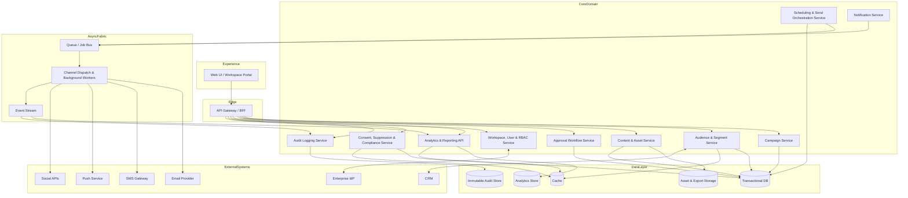

### Overview
This diagram shows the logical components of the CMS and the separation of transactional, orchestration, analytics, and compliance responsibilities.

### Key components
- **Web UI / Workspace Portal**: campaign planning, approvals, dashboards, admin, and reporting.
- **API Gateway / BFF**: request routing, authentication context, workspace scoping, response shaping for the UI.
- **Campaign Service**: campaign definitions, goals, channel configurations, lifecycle state.
- **Audience & Segment Service**: reusable segments, size estimation, CRM list import, exclusion lists.
- **Content & Asset Service**: templates, assets, previews, validation, version history.
- **Approval Workflow Service**: approval queue, comments, states, approval history.
- **Scheduling & Send Orchestration Service**: scheduling, pause/resume, recurring sends, A/B orchestration, provider dispatch jobs.
- **Analytics & Reporting API**: near-real-time dashboards, filtering, campaign comparison, export requests.
- **Workspace, User & RBAC Service**: workspace membership, role assignment, admin policy.
- **Consent, Suppression & Compliance Service**: per-contact and per-channel opt-in/out, legal basis, suppression lists, data policy checks.
- **Notification Service**: in-app and email notifications for approvals and operational events.
- **Audit Logging Service**: durable log of create/update/delete/export/approval/admin actions.
- **Queue / Event Stream / Workers**: decouple user requests from heavy background processing.

### Relationships
- Synchronous user-facing operations go through the BFF.
- State changes and long-running actions generate jobs/events.
- Workers dispatch messages to external providers and emit delivery/performance events.
- Analytics ingests event streams into an analytics store optimized for sub-3-second queries.
- Compliance and audit services operate across all domains.

### Design decisions
- Separate **transactional** and **analytical** workloads to prevent reporting from affecting operational performance.
- Keep **compliance** as a dedicated service so unsubscribe, consent, and workspace constraints are consistently enforced.
- Use a **BFF** to simplify the frontend and centralize auth/workspace context propagation.

### NFR considerations
- **Scalability**: worker pools and event consumers scale horizontally; analytics scales independently of campaign authoring.
- **Performance**: hot cache + OLAP store keep dashboard/report queries within 3 seconds for up to 1M records.
- **Security**: RBAC/workspace checks at BFF and service layers; audit and compliance are centralized.
- **Reliability**: queues isolate spikes and downstream provider failures; retries and dead-letter queues protect throughput.
- **Maintainability**: clear domain boundaries support future service extraction without redesign.

### Trade-offs
- More components than a simple CRUD app, but necessary for send volume, compliance, and analytics SLAs.
- A BFF introduces an extra layer, but it reduces frontend complexity and improves policy consistency.

### Risks and mitigations
- **Risk**: event duplication or out-of-order delivery.  
  **Mitigation**: idempotent event processing, deduplication keys, event timestamps, reconciliation jobs.
- **Risk**: cross-service policy drift.  
  **Mitigation**: centralized authorization and compliance policy libraries, contract testing.

---

## Deployment Architecture

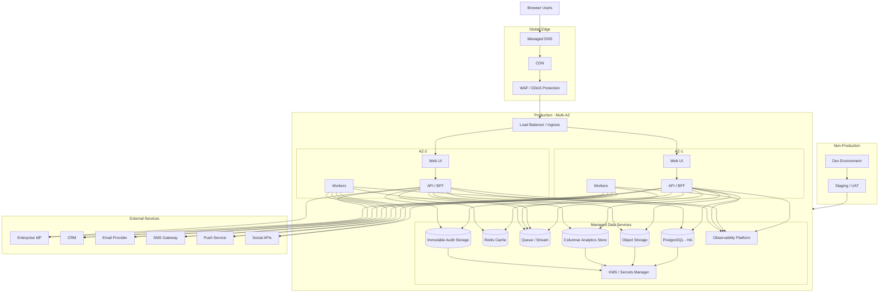

### Overview
This deployment diagram shows a cloud-native, multi-AZ production environment with separate non-production stages, managed data services, and external integrations.

### Key components
- **Global edge**: DNS, CDN, and WAF improve performance and security.
- **Multi-AZ application tier**: stateless UI/API nodes and worker nodes across at least two availability zones.
- **Managed data services**: HA relational DB, cache, queue/stream, analytics store, object storage, immutable audit storage.
- **Security platform**: KMS and secrets management.
- **Observability**: centralized logs, metrics, traces, alerting.
- **Environment separation**: dev, staging/UAT, production.

### Relationships
- User traffic enters through edge controls before hitting the load balancer.
- Stateless application nodes scale horizontally and consume managed backend services.
- Workers interact with external providers asynchronously.
- Promotion flows from dev to staging to production.

### Design decisions
- Use **managed services** for databases, queues, analytics, and object storage to improve resilience and reduce operational burden.
- Deploy across **multiple AZs** to meet 99.9% uptime with minimal complexity.
- Keep **production isolated** from non-production to reduce risk and support audit requirements.

### NFR considerations
- **Scalability**: worker fleets and stateless APIs scale independently; queue depth drives autoscaling.
- **Performance**: CDN offloads static content; cache reduces repeated reads; OLAP isolates analytical queries.
- **Security**: WAF, private data services, KMS-backed encryption, secret rotation.
- **Reliability**: multi-AZ deployment, health checks, backups, point-in-time recovery, dead-letter queues.
- **Maintainability**: infrastructure standardization across environments supports repeatable deployment.

### Trade-offs
- Managed services increase cloud cost but reduce operational risk and staffing needs.
- Single-region multi-AZ is sufficient for 99.9% uptime, but not for the strongest disaster recovery posture.

### Risks and mitigations
- **Risk**: regional outage.  
  **Mitigation**: backup replication, documented DR runbooks, optional cross-region warm standby in target architecture.
- **Risk**: noisy analytical workloads.  
  **Mitigation**: separate OLAP store and workload isolation from transactional DB.

---

## Data Flow

```mermaid
flowchart LR
    CRM[CRM / Contact Data] --> Ingest[Audience Ingestion & Validation]
    CSV[CSV Upload] --> Ingest
    Ingest --> Segment[Segment Builder & Estimator]
    Segment --> Campaign[Campaign Configuration]
    Campaign --> Content[Content & Asset Binding]
    Content --> Validate[Pre-send Validation]
    Validate --> Approval[Approval Workflow]
    Approval --> Schedule[Scheduler / Recurrence Engine]
    Schedule --> Queue[Dispatch Queue]

    Queue --> Dispatch[Channel Dispatch Workers]
    Dispatch --> ESP[Email Provider]
    Dispatch --> SMS[SMS Gateway]
    Dispatch --> Push[Push Service]
    Dispatch --> Social[Social APIs]

    ESP --> Events[Delivery / Open / Click / Bounce Events]
    SMS --> Events
    Push --> Events
    Social --> Events

    Events --> Stream[Streaming / Event Processing]
    Stream --> Agg[Hot Aggregations]
    Stream --> Raw[(Raw Event Store)]
    Agg --> OLAP[(Analytics Store)]
    Raw --> OLAP
    OLAP --> Dash[Dashboards & Reports]
    OLAP --> Export[CSV / PDF Exports]

    Consent[Consent / Suppression Store] --> Dispatch
    Audit[Audit Service] --> AuditStore[(Immutable Audit Store)]
    Campaign --> Audit
    Approval --> Audit
    Export --> Audit
```

### Overview
This diagram illustrates how audience data, campaign definitions, content, approval states, sends, and engagement events move through the platform from ingestion to reporting.

### Key components
- **Ingestion & validation**: normalizes CRM and CSV inputs.
- **Segment builder**: creates target and exclusion audiences and estimates audience size.
- **Pre-send validation**: enforces content and compliance checks before approval/scheduling.
- **Scheduler and dispatch workers**: convert approved campaign definitions into provider-specific sends.
- **Streaming / event processing**: ingests delivery and engagement events.
- **Analytics store**: serves dashboards, comparisons, and exports.
- **Consent / suppression**: filters recipients before dispatch.
- **Audit service**: records all sensitive and reportable actions.

### Relationships
- Audience and campaign planning are synchronous from the user perspective.
- Sends and analytics are asynchronous and event-driven.
- Consent and suppression are consulted before dispatch.
- Exports are generated from analytics data and also logged for governance.

### Design decisions
- Split **raw event capture** from **aggregated analytics serving**.
- Use **pre-send validation gates** before a campaign can move to approval or launch.
- Keep **consent enforcement** in the execution path rather than as a reporting-only function.

### NFR considerations
- **Scalability**: queues and stream processors support 10M sends/day and bursty event ingestion.
- **Performance**: pre-aggregated metrics plus OLAP reduce dashboard latency to meet the 3-second target.
- **Security**: only needed data flows to channel providers; exports and audits are controlled.
- **Reliability**: replayable event streams and raw event storage support reconciliation.
- **Maintainability**: the flow separates ingestion, orchestration, and analytics concerns.

### Trade-offs
- Additional stream processing infrastructure increases complexity.
- Eventual consistency means analytics may lag by seconds to a few minutes, though user-facing dashboards remain near-real-time.

### Risks and mitigations
- **Risk**: delayed provider callbacks distort live dashboards.  
  **Mitigation**: distinguish “sent,” “delivered,” and “engagement” timestamps; show freshness indicators.
- **Risk**: bad CSV uploads contaminate audience data.  
  **Mitigation**: schema checks, sample preview, row-level error reporting, quarantine for invalid records.

---

## Key Workflows

### Workflow 1: create, approve, schedule, and launch campaign

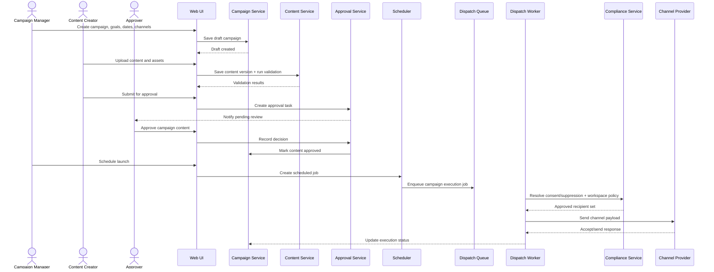

### Workflow 2: analytics query and campaign performance review

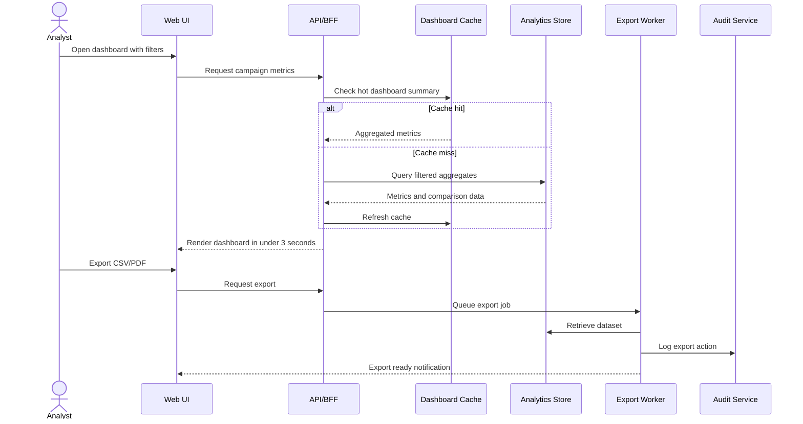

### Overview
These sequence diagrams show the two most important user journeys: launching a compliant, approved campaign and retrieving actionable analytics quickly.

### Key components
- Campaign users, approvers, and analysts
- Core domain services
- Scheduler and dispatch workers
- Compliance enforcement
- Analytics cache and OLAP store

### Relationships
- Approval is a hard gate before scheduling.
- Dispatch is asynchronous and policy-checked.
- Analytics uses cache-first reads to satisfy tight latency requirements.
- Export generation is asynchronous and auditable.

### Design decisions
- Approval and compliance are enforced before launch, not retroactively.
- Exports are queued instead of generated inline to protect interactive performance.
- Analytics queries never hit the transactional database for large reporting workloads.

### NFR considerations
- **Scalability**: background execution protects the UI from send spikes.
- **Performance**: cache + OLAP + async exports support the 3-second analytics target.
- **Security**: every step respects auth, workspace scope, and export auditing.
- **Reliability**: queue-based scheduling allows retries and pause/resume controls.
- **Maintainability**: workflows map cleanly to product requirements and operational monitoring.

### Trade-offs
- Slight delay between scheduling and dispatch visibility due to queueing.
- Dashboard freshness is near-real-time rather than strictly real-time.

### Risks and mitigations
- **Risk**: approval bypass through edge-case API flows.  
  **Mitigation**: enforce state transitions server-side, not only in the UI.
- **Risk**: export abuse or data leakage.  
  **Mitigation**: RBAC on export actions, watermarking, rate limits, full audit trail.

---

## Additional Diagrams as Needed

### Security architecture

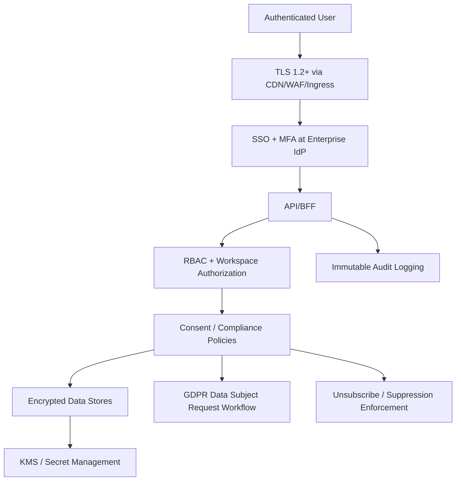

#### Overview
This diagram shows the layered security model from user access through authorization, compliance enforcement, encrypted storage, and auditability.

#### Key components
- **TLS edge**: secure ingress path.
- **SSO + MFA**: enterprise identity control.
- **RBAC + workspace authorization**: least-privilege access and tenant/workspace isolation.
- **Consent/compliance policies**: CAN-SPAM, GDPR, CASL rules in execution flows.
- **Encrypted data stores**: AES-256 at rest.
- **Audit and KMS**: traceability and key protection.
- **DSR workflow**: erase/export/anonymize requests for GDPR.

#### Relationships
- Authentication establishes identity.
- Authorization determines what workspace and actions are allowed.
- Compliance checks determine whether data can be processed or recipients can be contacted.
- Audit captures sensitive actions across the stack.

#### Design decisions
- Enforce security in layers rather than relying on a single gateway.
- Treat workspace isolation as both an app-layer and data-layer concern.
- Put unsubscribe/suppression checks directly in the send path.

#### NFR considerations
- **Security**: directly addresses TLS, AES-256, RBAC, workspace isolation, and audit retention.
- **Reliability**: immutable audit reduces repudiation risk; KMS limits blast radius of key exposure.
- **Maintainability**: centralized policy enforcement lowers risk of inconsistent implementations.

#### Trade-offs
- Strong policy checks add some latency, but the impact is small relative to background send processing.
- DSR and retention workflows add operational governance complexity.

#### Risks and mitigations
- **Risk**: over-permissive roles.  
  **Mitigation**: role templates, approval for privilege elevation, periodic access review.
- **Risk**: tenant/workspace data leakage.  
  **Mitigation**: mandatory workspace scoping in tokens, row-level filters, authorization tests, export review.

---

### Integration architecture

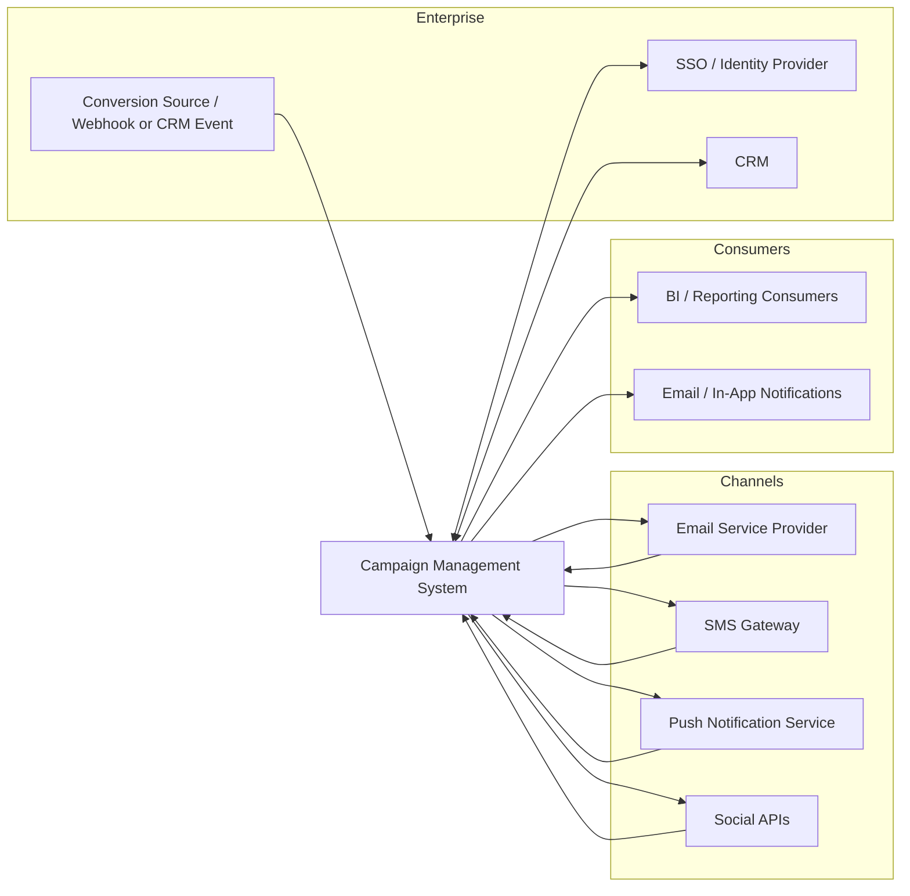

#### Overview
This diagram highlights the integration landscape and clarifies that the CMS orchestrates campaign operations while relying on existing enterprise and channel platforms.

#### Key components
- Identity provider
- CRM
- Channel providers
- Conversion event source
- BI/report consumers
- Notification pathways

#### Relationships
- Identity and CRM are bidirectional enterprise integrations.
- Delivery providers receive outbound campaign sends and return delivery/engagement events.
- Conversion events may arrive from a webhook, tracking pixel service, or CRM-originated event.
- BI/report consumers receive exported or shared outputs.

#### Design decisions
- Keep integrations behind adapters so providers can be changed with minimal business-logic impact.
- Use normalized internal event models to avoid channel-specific coupling.

#### NFR considerations
- **Scalability**: provider adapters can scale independently.
- **Performance**: asynchronous callbacks prevent external dependencies from slowing the UI.
- **Security**: signed webhooks, IP allowlists where possible, secret rotation.
- **Reliability**: retryable outbound integrations and replayable inbound events.
- **Maintainability**: adapter pattern reduces vendor lock-in.

#### Trade-offs
- Normalization adds transformation overhead.
- Each provider requires operational knowledge and test harnesses.

#### Risks and mitigations
- **Risk**: provider API changes.  
  **Mitigation**: adapter abstraction, contract tests, feature flags.
- **Risk**: missing or duplicated callbacks.  
  **Mitigation**: idempotency keys, reconciliation jobs against provider reports.

---

### ERD (logical data model)

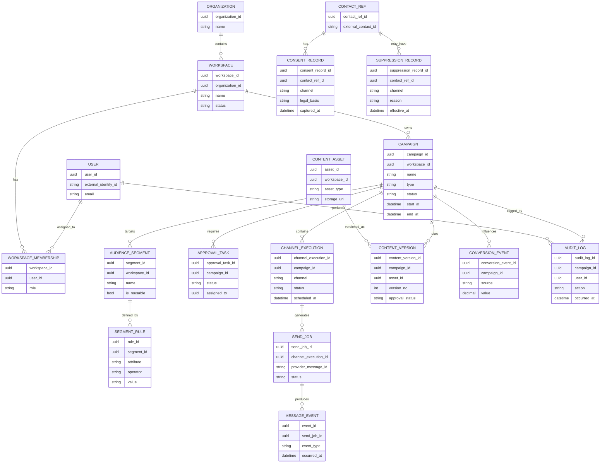

#### Overview
This logical ERD shows the main entities required to support workspaces, campaigns, content versioning, audience definitions, approvals, send execution, consent, and audit.

#### Key components
- Workspaces and memberships for isolation
- Campaign and channel execution entities
- Content assets and versions for approval traceability
- Segments and rules for targeting
- Send jobs and events for execution and analytics
- Consent and suppression for compliance
- Audit logs for accountability

#### Relationships
- A workspace owns campaigns, assets, and segments.
- Campaigns have many channel executions, approval tasks, and content versions.
- Send jobs produce message events that feed analytics.
- Contacts have consent and suppression records that control eligibility.

#### Design decisions
- Keep **contact identity as a reference** to the CRM rather than copying the full customer master.
- Separate **asset** from **content version** so version history survives file replacement.
- Model **consent** and **suppression** independently to support legal basis, channel specificity, and operational opt-out behavior.

#### NFR considerations
- **Performance**: normalized transactional model supports integrity; analytics are served from a separate denormalized store.
- **Security**: minimal-contact-reference approach reduces unnecessary PII duplication.
- **Maintainability**: clear entity boundaries support future schema evolution.
- **Compliance**: explicit consent/suppression records and audit entities support regulatory requirements.

#### Trade-offs
- More tables and joins in the transactional model.
- Requires ETL/stream projection into analytics-friendly structures.

#### Risks and mitigations
- **Risk**: accidental PII sprawl into non-core tables.  
  **Mitigation**: data classification, schema review, field-level governance, masking in lower environments.
- **Risk**: schema drift across versions.  
  **Mitigation**: migration discipline, schema registry for event payloads.

---

## Phased Development

### Phase 1: initial implementation (MVP)

**Goal:** deliver campaign planning, approvals, scheduling, multi-channel execution, workspace control, basic dashboards, and compliance essentials without over-engineering.

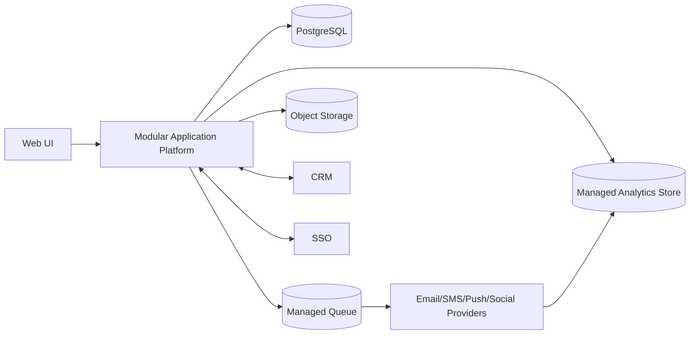

#### MVP scope
- Campaign creation and draft management
- Audience segmentation with CRM import and CSV upload
- Content library and versioning
- Approval workflow
- Scheduling, pause/resume, recurring sends
- Email, SMS, push, and social connectors
- Basic A/B testing
- Real-time status dashboard and core reports
- RBAC, workspace isolation, audit logging
- Consent/unsubscribe and suppression handling

#### MVP design choices
- One deployment unit for the core app, plus background workers
- Managed queue for sends and notifications
- Managed OLAP store from day one because the analytics SLA is too tight for a relational-only approach
- Single-region, multi-AZ production for 99.9% uptime
- Direct integrations to one provider per channel where possible

### Phase 2+: final architecture (target)

**Goal:** improve scalability, resilience, data governance, and extensibility as usage, channels, and organizational complexity grow.

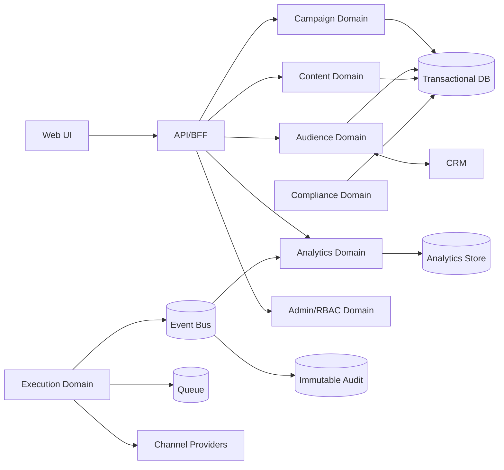

#### Target enhancements
- Service extraction for execution, analytics, compliance, and integrations
- Dedicated event bus for richer telemetry and replay
- Cross-region DR or warm standby
- Advanced rate limiting and channel-specific throughput tuning
- More sophisticated attribution/conversion pipeline
- Self-service BI and governed semantic metrics layer
- Extended policy engine for residency, retention, and legal workflows

### Migration path
1. **Start modular** with clear internal domain boundaries and explicit APIs/events between modules.
2. **Introduce an event contract** early, even if modules initially run in one deployment unit.
3. **Extract execution workers first** when send volume and provider diversity increase.
4. **Extract analytics pipeline second** when reporting load or data science use cases grow.
5. **Extract compliance/policy services** if regulatory complexity and regional policy divergence increase.
6. **Add regional resilience** when business continuity requirements exceed single-region 99.9% objectives.

### Why this phased model is appropriate
- It keeps delivery speed high for initial business value.
- It avoids premature distributed-systems complexity.
- It still protects future scale by making boundaries explicit from the start.

---

## NFR Analysis

### Scalability
- **10M sends/day** is best handled through asynchronous dispatch rather than synchronous request-driven sending.
- A queue-based worker tier allows horizontal scale based on pending jobs and provider callback volume.
- Provider-specific throttling protects sender reputation and respects partner rate limits.
- Audience evaluation should use cached segment metadata and precompiled filters where possible.
- The target design allows scale-out of execution and analytics independently.

### Performance
- **Dashboard and report SLA: under 3 seconds for up to 1M records**.
- This requires:
  - a **columnar analytics store**
  - **pre-aggregated campaign/channel/day/hour facts**
  - **cache for hot dashboard queries**
  - **asynchronous export generation**
  - separation of analytical and transactional workloads
- Segment size estimation should return fast approximations for design-time UX, then refine asynchronously if needed.
- Heavy comparison reports should use precomputed metrics and bounded query dimensions.

### Security
- **TLS 1.2+** for all external and internal service-to-service traffic where supported.
- **AES-256 at rest** through managed encryption and KMS-backed keys.
- **SSO with MFA** via the organization’s identity provider.
- **RBAC and workspace isolation** enforced in:
  - identity claims
  - BFF/API authorization
  - service-layer checks
  - data-access filtering
- Secrets stored in a centralized secrets manager, not in application configuration.
- Webhooks signed and validated; provider credentials rotated regularly.

### Reliability
- **99.9% uptime** is achieved through:
  - multi-AZ stateless app deployment
  - managed HA databases
  - queue-based decoupling
  - health checks and automated restart
  - alerting on queue depth, provider failures, and latency
  - backup and point-in-time recovery
- Pause/resume and retry semantics reduce business impact during partial failures.
- Dead-letter queues and reconciliation jobs ensure failed sends/events are investigated and replayed safely.

### Maintainability
- Clear domain boundaries reduce coupling between planning, execution, analytics, and compliance.
- Managed platform services reduce operational burden.
- Observability with logs, metrics, and traces shortens incident resolution.
- Feature flags allow controlled rollout of channels, providers, and policy changes.
- Infrastructure-as-code and environment parity reduce deployment drift.

### Compliance and data governance
- **GDPR**
  - lawful basis/consent tracking
  - right to erasure and export workflows
  - minimization of copied customer data
  - retention policies and anonymization where appropriate
- **CAN-SPAM / CASL**
  - unsubscribe links and suppression enforcement
  - consent capture and timestamping
  - sender identity and campaign metadata controls
- **Audit retention**
  - retain audit logs for **36 months**
  - retain campaign analytics for **24 months minimum**
- **Export governance**
  - log all exports
  - apply RBAC to export actions
  - optionally watermark or tag exports with user/time metadata

### Browser and UX constraints
- Browser-based delivery is fully compatible with the requirement for standard browsers only.
- The UI should be optimized for the latest two versions of Chrome, Firefox, Safari, and Edge.
- For global teams, timezone-aware scheduling must be first-class in the domain model.

---

## Risks and Mitigations

| Risk | Impact | Mitigation |
|---|---|---|
| Analytics queries exceed 3 seconds under filter-heavy usage | Poor analyst experience, missed SLA | Pre-aggregations, cache, OLAP store, query guardrails, async exports |
| Send spikes overwhelm worker capacity or providers | Delays, failed launches | Queue-based autoscaling, provider throttling, burst controls, backpressure |
| Provider outages or degraded APIs | Partial campaign failure | Retries, circuit breakers, fallback provider strategy where feasible, status dashboards |
| Workspace isolation bug causes cross-tenant visibility | Severe security/compliance issue | Authorization at multiple layers, mandatory workspace claims, automated access tests |
| Consent/suppression not consistently enforced | Legal and brand risk | Centralized compliance service, send-path checks, provider suppression sync, audit evidence |
| CRM data quality issues produce bad segments | Campaign targeting errors | Validation, preview counts, stale-data indicators, import reconciliation |
| Export features leak sensitive data | Compliance and insider-risk issue | Export RBAC, audit, rate limits, watermarking, optional approval for bulk exports |
| Audit logs become too expensive at 36-month retention | Cost pressure | Tiered storage, compression, immutable archive, searchable index over recent data only |
| A/B automation picks a misleading winner | Poor campaign results | Minimum sample thresholds, configurable confidence rules, manual override |
| Regional outage affects availability | Service interruption | Backup replication, tested DR runbooks, target-state warm standby/cross-region replication |

---

## Technology Stack Recommendations

The exact vendor can vary by cloud, but the architectural roles should remain consistent.

### Frontend and edge
- **Web UI**: modern SPA or SSR web application framework
- **CDN**: for static asset acceleration
- **WAF / DDoS protection**: protect the public edge
- **API Gateway / BFF**: central entry point for UI APIs

### Application runtime
- **Containerized application platform** on managed Kubernetes or serverless containers
  - Good balance of portability, autoscaling, and operational control
  - Supports separate scaling for API and worker workloads

### Data and storage
- **PostgreSQL (managed HA)** for transactional data
  - Strong consistency for campaigns, approvals, roles, schedules, and consent records
- **Redis** for cache/session/short-lived aggregations
- **Object storage** for assets, generated exports, and long-lived artifacts
- **Columnar analytics store** such as ClickHouse, BigQuery, Redshift, or equivalent
  - Best fit for sub-3-second analytical queries over large event datasets
- **Immutable audit storage** or WORM-capable archive for long-term audit retention

### Messaging and events
- **Managed queue service** for dispatch jobs, notifications, exports, and retries
- **Event streaming platform** for message events and analytics pipelines in the target state

### Identity and security
- **OIDC/SAML integration** with enterprise IdP
- **KMS + Secrets Manager** for encryption keys and provider credentials
- **Centralized policy enforcement** for RBAC and workspace authorization
- **OpenTelemetry + SIEM/SOC integration** for security and operational monitoring

### Reporting and observability
- **Observability**: logs, metrics, traces, alerting
- **BI integration**: controlled exports and/or semantic views over analytics data

### Why this stack fits
- It directly supports the throughput, uptime, and compliance requirements.
- It minimizes custom infrastructure.
- It allows a clean MVP while preserving a credible path to the target architecture.

---

## Next Steps

1. **Confirm open integration decisions**
   - Email service provider for Phase 1
   - SSO provider specifics
   - Conversion tracking mechanism
   - Legal approval on default retention and deletion policy

2. **Define architecture guardrails**
   - Workspace isolation model
   - RBAC role matrix
   - data classification and PII handling rules
   - audit event taxonomy

3. **Produce detailed design artifacts**
   - API contracts
   - event schemas
   - provider adapter specifications
   - dashboard metric definitions and semantic rules

4. **Validate the analytics design**
   - Model expected event volume and peak concurrency
   - Prototype 1M-record query patterns in the chosen analytics store
   - Define pre-aggregation strategy and dashboard freshness targets

5. **Run compliance and security workshops**
   - GDPR DSR workflow
   - CAN-SPAM/CASL operational controls
   - suppression and unsubscribe policy
   - export governance and audit review

6. **Plan delivery by phase**
   - MVP feature cut
   - operational readiness checklist
   - SLOs, alert thresholds, and runbooks
   - migration triggers for extracting services in Phase 2+
